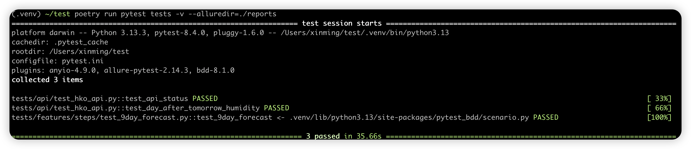

# Automated Testing for MyObservatory App (9-Day Forecast)

Here is the designed test automation solution for the MyObservatory app using Python and uiautomator2. 

## Solution Design

### Tech Stack
- **Test Framework**: Pytest (Behavior-driven style with pytest-bdd)
- **Mobile Automation**: uiautomator2 for Android (Appium alternative)
- **API Testing**: Requests library
- **Reporting**: Allure for beautiful test reports
- **Package Management**: Poetry

### Architecture
```
.
├── conftest.py            # Pytest configuration with shared test fixtures
├── pages/                 # Contains Page Object Model classes
│   └── nine_day_forecast.py # Defines the 9-day forecast page elements
├── poetry.lock            # Locks exact dependency versions
├── pyproject.toml         # Project metadata and dependencies
├── pytest.ini             # Pytest configuration settings
├── README.md              # Project documentation
├── report-html/           # Final HTML test reports
├── reports/               # Raw test data for reports
├── screenshots/           # Test failure screenshots
├── tests/                 # Additional test files
│   ├── features/          # Business-readable test scenarios
│   └── steps/             # Test step implementations
└── utils/                 # Utility functions
    └── helpers.py         # Common helper methods
```

## Setup Guide

1. **Prerequisites**:
   - Python 3.8+
   - Android device/emulator with USB debugging enabled
   - MyObservatory app installed

2. **Installation**:

   ```bash
   # Install poetry
   pip install poetry

   # Clone repository
   git clone https://github.com/yxm0513/myobservatory-tests.git
   cd myobservatory-tests

   # Install dependencies
   poetry install

   # Connect to Android device
   adb devices
   ```

3. **Running Tests**:

   ```bash
   # Run UI tests
   poetry run pytest tests/features -v --alluredir=./reports

   # Run API tests
   poetry run pytest tests/api -v

   # Generate report
   allure serve ./reports
   
   # Run all tests 
   poetry run pytest tests -v --alluredir=./reports

   allure serve ./reports 

   # Generate HTML reports
   allure generate ./reports -o ./report-html --clean && allure open ./report-html
   ```
 
4. **Results**:
   


## Test Cases Covered

1. **UI Tests**:
   - Verify 9-Day Forecast screen navigation
   - Verify 9th day forecast data is displayed (date, weather, temperature, humidity)
   - Screenshot capture on failure

2. **API Tests**:
   - Verify API endpoint is accessible
   - Verify response structure
   - Extract humidity for day after tomorrow
   - Error handling for API failures

## Time Spent

- Research and design: 1 hours
- Implementation, Testing and debugging: 2.5 hour
- Documentation: 0.5 hour
- Total: ~4 hours

This solution provides a robust framework for both UI and API testing with good separation of concerns, clear reporting, and maintainable structure. The BDD approach makes the tests readable for non-technical stakeholders as well.
